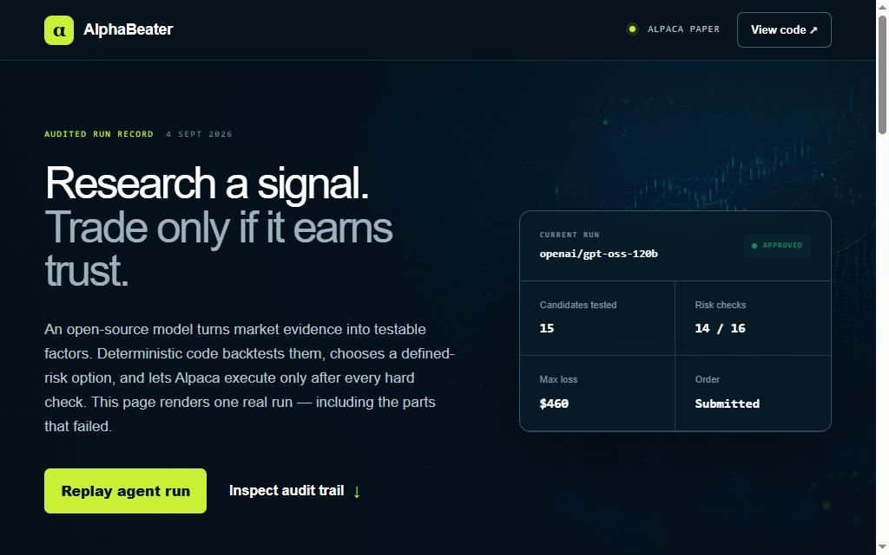
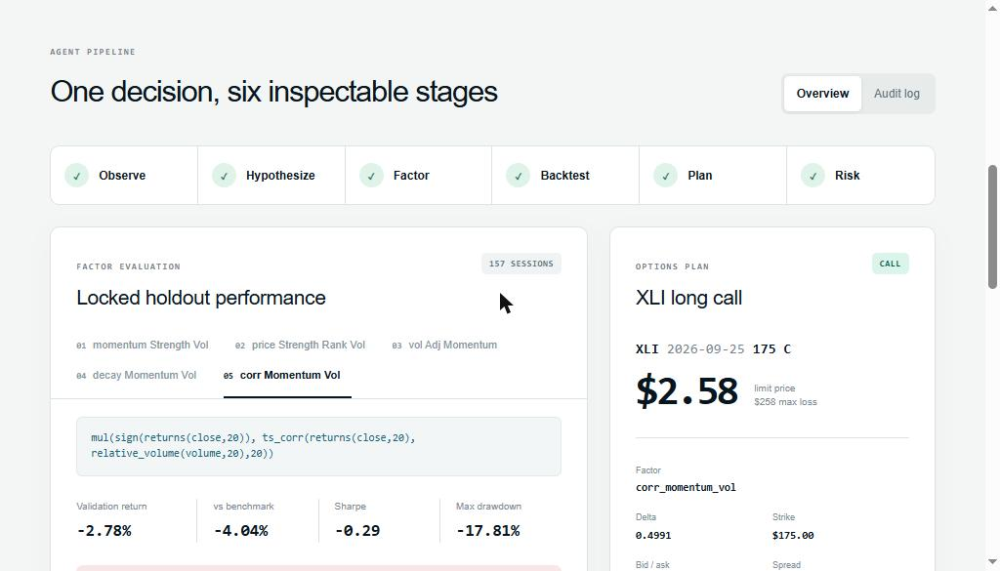
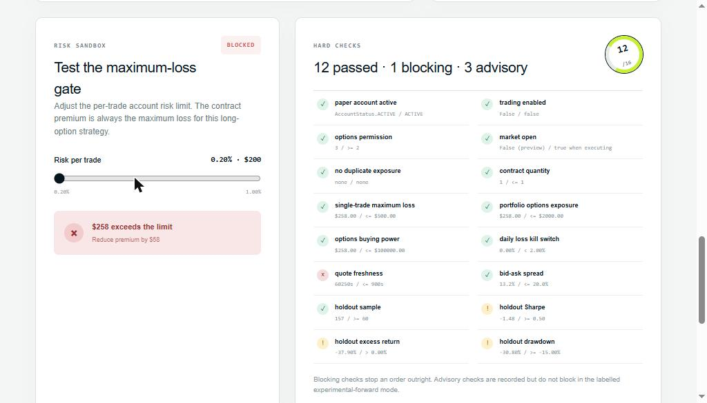

# AlphaBeater

**An options agent whose most important skill is refusing to trade.**

Most trading bots bolt an LLM onto indicators from the 1970s. AlphaBeater does something rarer: an
open-source model **invents new factor formulas**, deterministic Python grades them on data the
model never sees, and the agent is allowed to answer *"no trade"* — and usually does.

The model may propose. It may never execute. Every limit lives in Python the model cannot reach.



| | |
| --- | --- |
| **Universe** | 18 liquid, optionable US ETFs |
| **Factor language** | 6 fields, 20 operators, parsed not `eval`'d |
| **Evaluation** | chronological 50 / 20 / 30 split, locked test read once |
| **Risk gates** | 16 deterministic checks, 12 blocking |
| **Execution** | Alpaca official MCP server, paper only |
| **Research models** | `gpt-oss-120b` -> `DeepSeek-V3.1` -> `Gemma`, automatic failover |
| **Worst case per trade** | the premium paid - long options only, never naked |

## Why this is hard, and what we did about it

**An LLM will confidently invent a strategy that loses money.** So it never touches execution.
It writes a formula in a restricted language; Python parses that formula with `ast`, walks it, and
refuses anything outside the registered operator table. No `eval`, ever.

**A backtest will lie to you if you let it.** Split the history in time: train on the first half,
choose on the next 20%, and read the last 30% **once**, after choosing. Peek at the locked period
and you are memorising the answer key.

**Providers fail at the worst moment.** On 4 Sept 2026 the hosted Gemma endpoint returned `503` on
two of three measured runs. Research now runs through three models in order, so one outage cannot
cost a market window.

## The factor language

This is the trust boundary, so it is documented in full. An expression is a nested function call
over these fields and operators - nothing else parses.

**Fields:** `open` `high` `low` `close` `volume` `vwap`

| Operator | Signature | Notes |
| --- | --- | --- |
| `add` `sub` `mul` `div` | `add(a, b)` | arithmetic |
| `neg` | `neg(a)` | flip sign |
| `abs` | `abs(a)` | size of a move, ignoring direction |
| `sign` | `sign(a)` | -1, 0 or 1 |
| `returns` | `returns(series, window)` | percentage change over the window |
| `delay` | `delay(series, window)` | value N sessions ago |
| `ts_mean` `ts_std` `ts_min` `ts_max` | `ts_mean(series, window)` | rolling statistics |
| `ts_rank` | `ts_rank(series, window)` | where today sits in its own recent history |
| `ts_corr` | `ts_corr(a, b, window)` | rolling correlation of two series |
| `decay_linear` | `decay_linear(series, window)` | weighted average, recent days weigh more |
| `relative_volume` | `relative_volume(volume, window)` | today's volume versus its own average |
| `rank` | `rank(series)` | **cross-sectional** - no window |
| `zscore` | `zscore(series)` | **cross-sectional** - no window |
| `demean` | `demean(series)` | **cross-sectional** - this symbol minus the universe average |

`rank`, `zscore` and `demean` compare symbols *against each other on the same day*. They are the
reason breadth matters: with three symbols a cross-sectional rank has three possible values and
carries almost no information. `demean` is how a hypothesis like *"industrials are strong relative
to the market"* becomes an expression.

A real formula the model wrote, using three operators at once:

```
mul(sign(returns(close,20)), ts_corr(returns(close,20), relative_volume(volume,20), 20))
```

## The universe

`SPY QQQ IWM DIA MDY` · `EFA EEM` · `XLK XLF XLE XLV XLY XLI XLP SMH` · `GLD TLT HYG`

Broad market and size, geography, sectors, and diversifiers that behave differently from equities.
Every symbol is large, liquid and optionable. Defined in `src/alphabeater/universe.py` with the
reasoning; both entry points import it so it cannot drift.

## What one run looks like



The model proposes five formulas, each is calculated and backtested, and the strongest current
signal becomes a single defined-risk contract - 21 to 45 days out, 0.35 to 0.60 absolute delta,
spread under 20%, premium inside the risk budget.

## The 16 gates



Every check publishes what it measured and the limit it was measured against. **Blocking** checks
stop an order outright. Advisory checks are recorded but do not block in the explicitly labelled
experimental-forward mode.

The dashboard is not a mockup: it renders `docs/sample-run.json`, the sanitized record of a real
run, regenerated by `alphabeater-publish`.

## Current workflow

1. Read recent bars for the 18-symbol universe from Alpaca's IEX feed and summarize 5/20/60-day returns, price location, volatility, and relative volume.
2. Ask the research model for a falsifiable hypothesis grounded in that snapshot.
3. Run three precommitted research batches. Each asks the research model for a distinct hypothesis and five different factor candidates in the project's small factor DSL.
4. Validate and calculate each expression without `eval`.
5. Standardize each factor over the trailing 60 sessions, select the strongest absolute signal, and simulate its call/put direction with next-session underlying returns and 5 bps costs. Split observations chronologically into 50 percent training, 20 percent validation, and a locked 30 percent test period.
6. Reject candidates unless both training and validation have positive excess return, at least 0.50 Sharpe, and acceptable drawdown. Rank survivors using validation data only. Then evaluate the winner once on the locked test period.
7. Convert its current standardized signal into a long call or long put.
8. Search the Alpaca indicative option chain for 21 to 45 DTE, 0.35 to 0.60 absolute delta, a maximum 20 percent spread, and premium within the account risk budget.
9. Run 16 deterministic account, position, liquidity, loss, and backtest checks.
10. If `--execute` was explicitly supplied and all checks pass, submit one buy-to-open limit order to the Alpaca paper account through `place_option_order` on the official Alpaca MCP server.
11. Monitor open orders and positions for stale entries, stop loss, take profit, and expiry rules.

The strategy buys premium only. Its maximum loss is the premium paid. It does not write naked options or send live orders.

## Hackathon submission

**Alpaca paper trading account: `PA32L0D145M5`** - a new, dedicated account opened for this
hackathon, funded at exactly $100,000.00. Every order below is visible in that account.

## Latest verified run

On 4 September 2026 the agent ran end to end against live Alpaca data and **executed a paper
options trade through Alpaca's official MCP server.**

```
IWM260925P00294000     IWM $294 PUT, expiring 25 Sep 2026
BUY 1 @ limit $4.60  ->  FILLED @ $4.54
maximum loss $454, fixed by construction
```

`openai/gpt-oss-120b` generated **15 factor candidates** across three precommitted research
batches over the 18-symbol universe. **None passed the research gate.** The order was therefore
taken under the explicitly labelled `experimental_forward_paper` policy, which relaxes the three
*advisory* research checks and leaves every *blocking* safety check in force.

**14 of 16 risk checks passed, with zero blocking failures.** Quote freshness measured 0 seconds
against a 900 second limit. The two advisory failures are recorded honestly: holdout Sharpe 0.43
against a 0.50 requirement, and holdout excess return -6.08%.

### The number that matters most

The traded factor, `vol_norm_mr_signal3`:

| Period | Excess return | Sharpe | Selection saw it? |
| --- | --- | --- | --- |
| Training | -0.54% | 0.89 | yes |
| Validation | **+54.20%** | **1.67** | yes |
| **Locked holdout** | **-6.08%** | **0.43** | **no - read once, after choosing** |

A factor worth +54.20% excess return on the period used to choose it was worth **-6.08%** on the
period it had never seen. That collapse is the entire argument for a locked test set, and it is
the reason this run is labelled experimental rather than validated.

It also explains the rejection precisely: training excess return was **-0.54%**, and the gate
requires positive excess in *both* periods. It failed by half a percentage point on one criterion.

**This is not a claim of edge.** It is a disciplined, fully gated, fully audited trade on a signal
the agent itself declined to certify. The complete record is in
[`docs/sample-run.json`](docs/sample-run.json).

## Research model and evaluation

Research runs through `openai/gpt-oss-120b`, falling back to `deepseek-ai/DeepSeek-V3.1` and then `gemma-4-31b-it`. Each generates independent hypotheses and five candidate DSL formulas per hypothesis. The five available precommitted themes are trend, mean reversion, volatility regime, price-volume confirmation, and breakout/range behavior. No predictive ML model is trained or fitted. Python calculates every factor and return deterministically.

The chronological split is 50/20/30. The first half checks initial consistency, the next 20 percent selects one candidate, and the last 30 percent is a locked test used only after selection. A failed locked test stops the run. Repeated runs against the same locked period must not be used to search for a passing result.

During hackathon development, the holdout was inspected while the evaluation algorithm itself was being corrected. Current results are therefore exploratory, not a publication-grade untouched test. A future paper should freeze the pipeline and collect a new forward test period.

The backtest is a directional underlying-return proxy for comparing factors. It does not reconstruct historical option-chain prices, implied volatility, or option fills. Paper execution supplies the separate end-to-end options evidence.

The complete protocol, period boundaries, model name, development metrics, selected test metrics, and risk decision are saved in `artifacts/latest-run.json`.

Use `--research-batches 1` through `5` to set the precommitted search size. The default is three. Batches are generated before the locked test is evaluated and never receive test feedback.

Use `--reuse-research artifacts/previous-run.json` to recalculate a saved candidate batch without spending Gemini quota or changing the precommitted formulas.

## Setup

Python 3.11 or newer and [uv](https://docs.astral.sh/uv/) are required. `uvx` launches Alpaca's MCP server without a separate server install.

```bash
python -m venv .venv
# Windows: .venv\Scripts\activate
# macOS/Linux: source .venv/bin/activate
pip install -e ".[dev]"
copy .env.example .env
```

Add a Google AI Studio key and Alpaca paper keys to `.env`. Never commit that file.

```dotenv
GEMINI_API_KEY=...
GEMMA_MODEL=gemma-4-31b-it
FEATHERLESS_API_KEY=...
FEATHERLESS_MODEL=openai/gpt-oss-120b
FEATHERLESS_BACKUP_MODEL=deepseek-ai/DeepSeek-V3.1
ALPACA_API_KEY=...
ALPACA_SECRET_KEY=...
ALPACA_PAPER=true
```

## Verify each integration

```bash
# Paper account and research model configuration
alphabeater-check

# Alpaca IEX bars and indicative options chain
alphabeater-data-check

# Official Alpaca MCP server and paper account
alphabeater-mcp-check

# Hypothesis, factor calculation, and backtests
alphabeater-research-demo
```

`alphabeater-mcp-check --describe` also shows the available trading tool schemas. It sets `ALPACA_PAPER_TRADE=true` for the MCP child process.

## Run the complete agent

Preview mode performs every stage but cannot submit an order:

```bash
alphabeater-run
```

The full audit record is written to `artifacts/latest-run.json`.

Paper execution is explicit:

```bash
alphabeater-run --execute
```

Even with that flag, no order is sent unless all 16 risk checks pass. Live trading is rejected by configuration. Orders use deterministic client order IDs so retries cannot silently create a second position.

An explicitly unvalidated forward paper experiment is available for execution demonstrations:

```bash
alphabeater-run --execute --paper-experiment
```

This mode may promote the least unstable development candidate when none is research-qualified. Historical performance checks remain visible as non-blocking advisories. Account status, paper-only enforcement, market hours, duplicate exposure, quantity, premium loss, total exposure, buying power, daily loss, quote freshness, and spread remain blocking. The audit labels the execution policy `experimental_forward_paper`; it must not be described as validated or predictably profitable.

## Autonomous monitoring

One read-only check:

```bash
alphabeater-monitor
```

Continuous monitoring every 30 seconds:

```bash
alphabeater-monitor --watch --interval 30
```

By default, the monitor only records recommended actions. Set `ENABLE_AUTOMATIC_EXITS=true` in `.env` to let it cancel stale paper entry orders and submit sell-to-close paper orders when one of these rules fires:

- Position loss reaches 25 percent
- Position gain reaches 40 percent
- Contract reaches 7 DTE
- Entry limit order remains open for 15 minutes

Events are appended to `artifacts/trading-journal.jsonl`.
Each monitor report also records position cost basis, market value, unrealized paper P&L, and return percentage.

## Risk policy

- Paper account only
- Account must be active and unblocked
- Options approval level 2 or higher
- One contract per trade
- Maximum trade loss: 0.5 percent of equity
- Maximum total options exposure: 2 percent of equity
- Daily loss kill switch: 2 percent
- Maximum relative spread: 20 percent
- Maximum quote age: 15 minutes
- At least 60 holdout observations
- Holdout Sharpe at least 0.50
- Positive holdout excess return
- Holdout drawdown no worse than -15 percent
- No duplicate open order or position in the selected contract
- Market must be open for execution

The implementation is in `src/alphabeater/risk.py`. The LLM cannot modify this policy during a run.

## Dashboard

The interactive demo is in `web/`. It contains a sanitized copy of the latest run and no credentials.

```bash
cd web
npm install
npm run dev
```

## Audit trail

Every run writes a complete decision record to `artifacts/latest-run.json`: the hypothesis, all
factor candidates, each backtest, the selected contract, and the result of every risk check.
That directory is gitignored because a completed run carries broker order identifiers.

A sanitized copy is committed at [`docs/sample-run.json`](docs/sample-run.json) so the record can
be inspected without credentials. Regenerate it after any run with:

```bash
alphabeater-publish
```

Identifiers are replaced with `[redacted]`; every metric and risk check is preserved.

## Tests

```bash
pytest
ruff check src tests
ruff format --check src tests

cd web
npm run lint
npm test
```

## Project layout

```text
src/alphabeater/
  agents/               idea and factor agents
  llm/                  provider adapters and the failover chain
  universe.py           the 18-symbol research universe
  alpaca/               paper account and market data adapters
  agent_run.py          complete workflow
  backtest.py           factor evaluation
  dsl.py                safe expression parser
  execution.py          paper SDK order adapter
  mcp_check.py          official Alpaca MCP connection
  mcp_execution.py      MCP option order adapter
  monitor.py            continuous order and position monitor
  options_strategy.py   signal and contract selection
  risk.py               hard trading limits
web/                    interactive hosted demo
```

## Safety

AlphaBeater is experimental research software, not financial advice. Options can lose their full premium. Live trading is out of scope.

## References

- Tang, Z. et al. (2025). [*AlphaAgent: LLM-Driven Alpha Mining with Regularized Exploration to Counteract Alpha Decay*](https://arxiv.org/abs/2502.16789). arXiv:2502.16789.
- [Alpaca MCP Server](https://github.com/alpacahq/alpaca-mcp-server)

## License

MIT. See [LICENSE](LICENSE).
